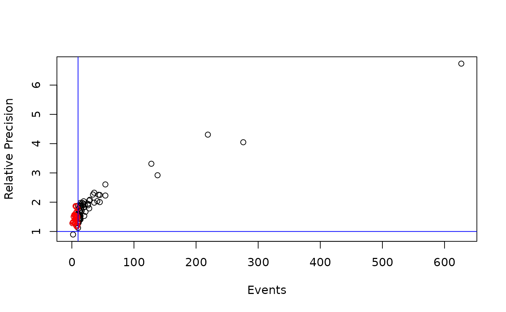
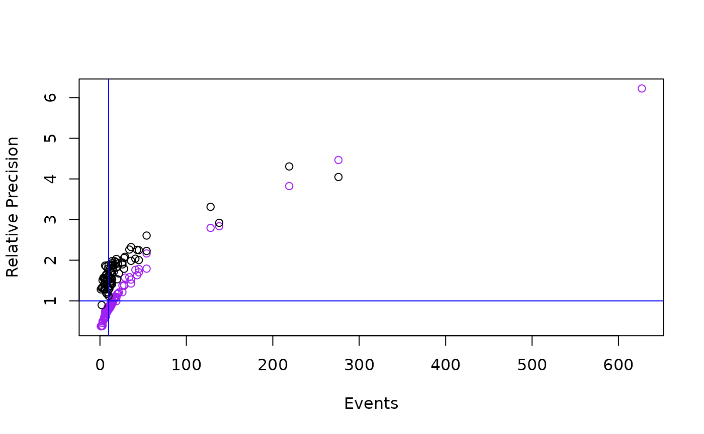
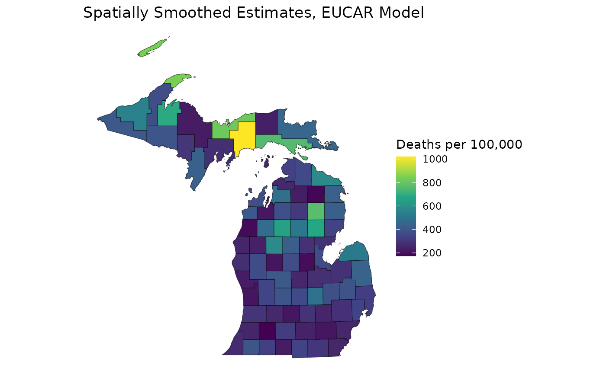
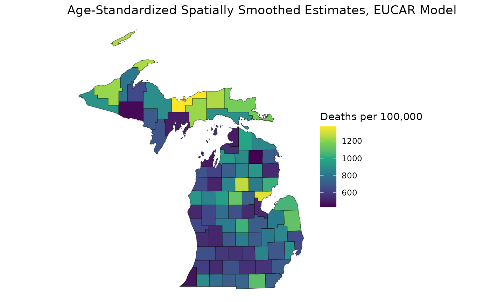

# 06: Model Informativeness

## Overview

Up to this point, we’ve discussed preparing count/adjacency data, model
setup, and age-standardization. In
[`vignette("RSTr-reliability")`](../articles/RSTr-reliability.md), we
discussed how to suppress estimates based on reliability criteria,
including population thresholds and relative precision. However, there
are cases where the event or population counts are too low for RSTr to
meaningfully gather information from neighboring regions; in these
cases, the standard BYM models will apply excessive spatial smoothing,
artificially inflating the estimate’s relative precision. In this
vignette, we will look under the hood of the CAR models and how they
perform spatial smoothing, discuss model informativeness, and how to
work with restricted models in your data.

## How does spatial smoothing work?

Spatial smoothing acts by way of a spatial random effects estimator `Z`;
this is essentially the parameter that tells the model how much to
either increase or decrease its corresponding estimated rate `lambda`.
In CAR models, the strength of `Z` itself is determined by a host of
factors, most importantly the spatial variance (`sig2` for UCAR; `G` for
MCAR and MSTCAR). We can investigate spatial smoothing further by
running a UCAR model to see the evolution of `Z` over time:

``` r
data_u <- lapply(miheart, \(x) x[, "55-64", "1979", drop = FALSE])
mod_ucar <- ucar("my_test_model", data_u, miadj, tempdir(), seed = 1234)
#> Starting sampler on Batch 1 at Thu Dec 11 00:06:14
```


    #> Generating estimates...
    #> Model finished at Thu Dec 11 00:06:21

The magnitude of `sig2` has further implications on the rate estimates
`lambda`. Smaller `sig2` values mean that the variance between neighbors
is also smaller. In short, the smaller the `sig2`, the closer in value
an estimate and its neighbors will be. When combined with the
comparatively intense smoothing applied to smaller event/population
regions, these unrestricted CAR models will work too hard to fill in the
gaps in information, not only pushing the estimate value too close to
the mean `beta` but also artificially inflating its relative precision.

In unrestricted CAR models, oversmoothing is partially addressed by
imposing an additional reliability criterion of either a population or
event threshold. If an estimate has a relative precision greater than 1,
we can still mark it as unreliable if this threshold is too small. We
can investigate this over all of our datapoints by comparing the event
counts to their corresponding relative precisions:

``` r
estimates <- get_estimates(mod_ucar)
estimates_supp <- estimates[estimates$relative_precision > 1 & estimates$events < 10, ]
plot(estimates$events, estimates$relative_precision, xlab = "Events", ylab = "Relative Precision")
points(estimates_supp$events, estimates_supp$relative_precision, col = "red")
abline(h = 1, col = "blue")
abline(v = 10, col = "blue")
```



The horizontal blue line shows the relative precision cutoff, and the
vertical blue line shows an event cutoff based on the suppression
criteria currently used by CDC WONDER (event counts less than 10 are
suppressed for privacy reasons). Red datapoints are below the population
threshold but above the relative precision threshold.

This plot showcases the intense oversmoothing done by the UCAR model in
small-event areas. Several regions with less than 10 events (25, or 30%
of our regions) have relative precisions well over the necessary
threshold for reliability, despite having low event counts. Hence, we
impose a threshold to prevent these estimates from being marked as
reliable. However, this only fixes part of the problem: relative
precisions will still be artificially inflated throughout our
non-suppressed estimates, even if to a lesser degree. To address this
issue, we need to stop the oversmoothing in the first place by placing a
limit on model informativeness.

## Model informativeness

Effectively, model informativeness quantifies the amount of ‘artificial
events’ added to the model through spatial smoothing. In our example
above, this resulted in 25 regions which had a sufficiently high number
of events added through oversmoothing to over-inflate their relative
precision.

The UCAR model’s informativeness, `a0`, is determined by a mix of the
spatial variance `sig2`, the non-spatial variance `tau2`, and the mean
region rate `beta` for Binomially-distributed likelihoods. For
Poisson-distributed likelihoods, only `sig2` and `tau2` determine
informativeness.

## The Enhanced UCAR (EUCAR) model

`RSTr` features unrestricted UCAR/MCAR/MSTCAR models, but also features
an enhanced UCAR (EUCAR) model which incorporates measures to prevent
oversmoothing. With the EUCAR model, we can limit our informativeness
`a0` to a ceiling, `A`, by tweaking the estimation process of `sig2`,
`tau2`, and `beta`. This will ensure that our spatial smoothing does not
contribute more than `A` events to any estimate in our model. There is
an additional `m0` parameter which defines a baseline number of
neighbors per region. Consequently, our spatial/non-spatial variances
will increase and our over-smoothing will be appropriately attenuated;
this will permit the model to allow more pronounced differences between
neighboring regions. Most importantly, this gives us a happy medium
between no smoothing in our crude estimates and oversmoothing caused by
unrestricted CAR models.

[Quick et
al. 2021](https://www.sciencedirect.com/science/article/pii/S1877584521000198)
suggests an informativeness ceiling `A` of 6 and an `m0` of 3 to ensure
that regions with event counts less than 10 will not erroneously
generate precise estimates. `RSTr` sets `A` to 6 and `m0` to 3 by
default.

Let’s run an EUCAR model using the [`eucar()`](../reference/ucar.md)
function, setting an informativeness ceiling of `A = 6`:

``` r
mod_eucar <- eucar("my_test_model", data_u, miadj, tempdir(), seed = 1234, A = 6)
#> Starting sampler on Batch 1 at Thu Dec 11 00:06:21
```


    #> Generating estimates...
    #> Model finished at Thu Dec 11 00:06:28

Notice that the traceplots for `tau2` and `sig2` in our enhanced (i.e.,
restricted) UCAR model have significantly higher values than those in
the unrestricted UCAR model. This is due to the EUCAR model ‘blocking’
lower values and ensuring that regions don’t oversmooth. We can directly
compare the two sets of results with another relative precision plot:

``` r
estimates_eucar <- get_estimates(mod_eucar)
plot(estimates_eucar$events, estimates_eucar$relative_precision, xlab = "Events", ylab = "Relative Precision", col = "purple")
points(estimates$events, estimates$relative_precision)
abline(h = 1, col = "blue")
abline(v = 10, col = "blue")
```



Here, the estimates for the EUCAR are in purple and the estimates for
the unrestricted UCAR are in black. Notice how the points on the purple
curve stay below the black curve at low event counts and that no purple
points enter the high-precision, low-event quadrant. With `A = 6`, the
points lie below 1 relative precision until events are greater than 10,
meaning this informativeness ceiling is smoothing an ideal amount. We
can also map the two estimates to visually compare the models:

``` r
library(ggplot2)
ggplot(mishp) +
  geom_sf(aes(fill = estimates$medians)) +
  labs(
    title = "Spatially Smoothed Estimates, Unrestricted UCAR Model",
    fill = "Deaths per 100,000"
  ) +
  scale_fill_viridis_c() +
  theme_void()
```


``` r
ggplot(mishp) +
  geom_sf(aes(fill = estimates_eucar$medians)) +
  labs(
    title = "Spatially Smoothed Estimates, EUCAR Model",
    fill = "Deaths per 100,000"
  ) +
  scale_fill_viridis_c() +
  theme_void()
```



As expected, the gradient of estimates is much more sharp on the EUCAR
model map in comparison to the unrestricted UCAR map. This is due to the
decreased intensity of our spatial smoothing. Additionally, the spread
of estimates for the EUCAR model is wider than that of the unrestricted
UCAR model because of its increased spatial variance.

## Enhanced models and age-standardization

When age-standardizing across a CAR model, informativeness is
cumulative: informativeness in individual rates when spatially smoothing
will compound the informativeness in estimates age-standardized by
spatially smoothed rates. Therefore, the EUCAR is an excellent choice
for modeling with age-standardization. Not only will individual
estimates not be over-smoothed, the age-standardized estimates will
benefit from enhanced reliability due to increased event counts in the
crude data.

We can re-run our model with three age groups: 65-74, 75-84, and 85+.
Since we are now running our models across multiple groups, we will need
to extend our `A`s to match the number of groups. Additionally, since
our informativeness measures are cumulative when age-standardizing, we
should split our `A = 6` informativeness ceiling among all of our groups
of interest. If we want, we can weight each group’s `A` by their total
events:

``` r
data_u <- lapply(miheart, \(x) x[, c("65-74", "75-84", "85+"), "1988", drop = FALSE])
A <- 6 * colSums(data_u$Y) / sum(data_u$Y)
mod_eucar <- eucar("test_eucar", data_u, miadj, tempdir(), seed = 1234, A = A)
#> Starting sampler on Batch 1 at Thu Dec 11 00:06:29
```


    #> Generating estimates...
    #> Model finished at Thu Dec 11 00:06:37

While our individual groups will have lower relative precisions due to
lower respective `A`s, when we age-standardize, we will have the same
effective smoothing power as our singular `A = 6` restricted model:

``` r
std_pop <- c(68775, 34116, 9888)
mod_eucar <- age_standardize(mod_eucar, std_pop, "65up")
est_eucar <- get_estimates(mod_eucar)
ggplot(mishp) +
  geom_sf(aes(fill = est_eucar$medians)) +
  labs(
    title = "Age-Standardized Spatially Smoothed Estimates, EUCAR Model",
    fill = "Deaths per 100,000"
  ) +
  scale_fill_viridis_c() +
  theme_void()
```



## The EUCAR Model, Reliability, and Suppression

Remember that for unrestricted CAR models, we have to impose an
additional event/population threshold for reliability to capture
high-precision estimates in low-event areas. As we saw in the
event/relative precision plot, these thresholds are no longer necessary
when we suppress our estimates with an EUCAR model:

``` r
mod_eucar <- suppress_estimates(mod_eucar)
est_eucar <- get_estimates(mod_eucar)
ggplot(mishp) +
  geom_sf(aes(fill = est_eucar$medians_suppressed)) +
  labs(
    title = "Spatially Smoothed Estimates, EUCAR Model",
    fill = "Deaths per 100,000"
  ) +
  scale_fill_viridis_c() +
  theme_void()
```


With the EUCAR model, we get the benefit of age-standardizing our
spatially smoothed estimates without the compounded oversmoothing from
unrestricted models.

## Choosing between enhanced vs unrestricted models

Now that we’ve elucidated the benefits of using enhanced models, we can
work through the most appropriate use case for each model:

- The EUCAR model is virtually always preferred to the unrestricted UCAR
  model. If you are not interested in temporal trends or group/time
  interactions, the EUCAR will likely be your best option, particularly
  if you are age-standardizing.

- The MCAR model is useful if you are specifically interested in
  interactions between sociodemographic groups and don’t have temporal
  data.

- The MSTCAR model is the best option when investigating *linear* trends
  in temporal data or if you are specifically interested in interactions
  between sociodemographic groups across time. If your trends depict
  multiple behaviors, it is recommended to either run two MSTCAR models
  with separate time periods for each trend or to run concurrent EUCAR
  models. Note that all `*car()` functions accept up to
  three-dimensional arrays and will concurrently run models for
  different groups/time periods if necessary.

## Future developments

Enhanced models for MCAR and MSTCAR continue to be under development.
Development for an enhanced Univariate Spatiotemporal CAR (USTCAR) model
is also underway. `RSTr` will incorporate these enhanced models as they
become available.

## Final thoughts

In this vignette, we investigated model informativeness and the tendency
of unrestricted BYM models to oversmooth estimates, along with some
benefits of enhanced CAR models. This vignette concludes the main
sections on using the functions in the `RSTr` package. After reading
these, you should be able to prepare your event and adjacency data,
choose and configure your model as necessary, age-standardize estimates,
and determine which estimates are reliable. If you are interested in the
more advanced features of the `RSTr` involving sample processing, read
[`vignette("RSTr-samples")`](../articles/RSTr-samples.md); if you’d like
more information on defining custom `initial_values` and `priors`, check
[`vignette("RSTr-initialvalues")`](../articles/RSTr-initialvalues.md)
and [`vignette("RSTr-priors")`](../articles/RSTr-priors.md),
respectively; if you are interested in learning more about how `RSTr`’s
models work, read
[`vignette("RSTr-models")`](../articles/RSTr-models.md).
